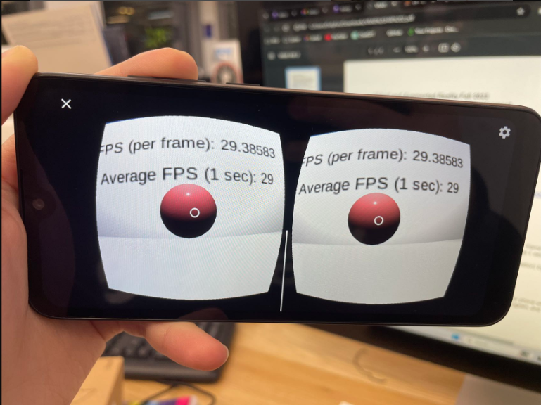
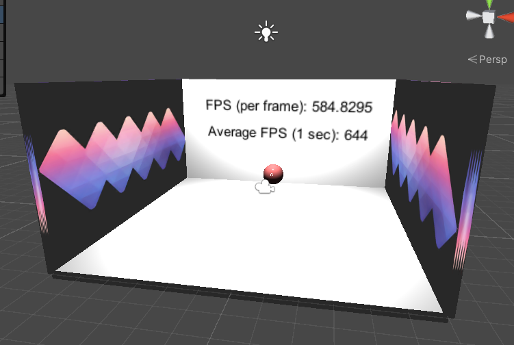
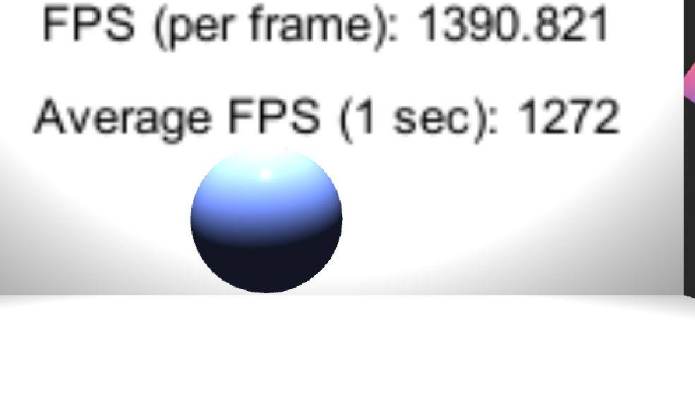

# Assignment2

> yn2273 Yuhe Nie

	

	

	

- Runs on your phone (2 pts)	
- Uses new assets (1 pts)
    - new environment

- Contains an interactable object (2 pts)
    - the ball turns red if selected, otherwise turn blue
- Computes and displays the FPS performance of each frame (5 pts)
- Computes and displays the average FPS over the past 1 second every frame (5 pts)

