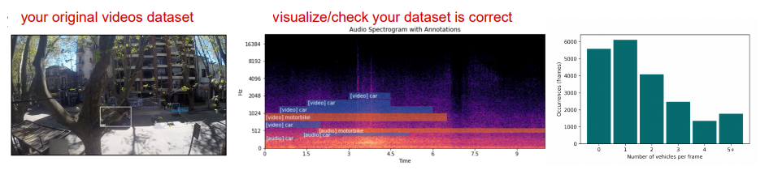

# Lecture1 Introduction to Machine Learning

## 1. Introduction

### Why Now?

- Hardware (GPUs developed for gaming industry)
- Datasets and benchmarks (internet took off)
- Algorithmic advances (making possible to train “deep” models)

### Why Deep Learning? 

- **Simplicity**: no feature engineering.
- **Scalable**: can be parallelized in multiple GPUs, faster.
- **Versatile and reusable**: viable for continuous online learning and  possible to reuse work from one project to another.

### What has Deep Learning Achieved?

- Near-human-level:
    - Image classification
    - Speech transcription
    - Handwriting transcription
    - Music transcription for some tasks (e.g. rhythm)
- Dramatically improved machine translation
- Dramatically improved text-to-speech conversion
- Digital assistants such as Google Assistant and Amazon Alexa
- Level=3..(ish) autonomous driving
- Improved ad targeting, as used for Google, Baidu or Bing
- Improved search results on the web
- Ability to answer natural language questions 
- Superhuman Go playing
- Text-to-Image prototyping

### Course Structure

#### Prerequisites

- Programming experience, preferably with Python
- Basic knowledge of linear algebra

#### Textbook

	

- Chollet, F. (2021). Deep learning with python.  Second Edition. Manning Publications.

#### Lectures

- Week 1: Introduction to Machine Learning
- Week 2: The building blocks of neural  networks
- Week 3: The engine of neural networks
- Week 4: Setting up a deep learning project
- Week 5: Classification
- Week 6: Convolutional NNs
- Week 7: Transformers and language models
- Week 8: Audio Understanding
- *Week 9: (Spring Breakes)*
- Week 10: Audio classification
- Week 11: Cross-modal retrieval
- Week 12: Neural style transfer
- Week 13: Image generation
- Week 14: Audio generation
- Week 15: Final project presentations

#### Grades

- 40% homework assignments (individual)
- 30% final project (groups)
- 30% class participation (individual and groups)

#### Homework

- There will be 3 homework assignments (two weeks to complete each)
- Instructions & submission will appear on Brightspace (it is your responsibility to check!)
- The lowest grade (out of 3 homework) will be dropped

#### Paper Presentation

- Role-playing paper reading (see syllabus)
- Roles
    - Academic researcher
    - Industry practitioner
    - Social impact assessor
- Each student playing a role:
    - Short presentation (5min)
    - Embrace your role! Other students
    - Ask questions! Participate!

- Each student will participate with one role during the semester
- Three roles per paper reading; you can choose which role based on your interests 
- Papers will be sent the week before presenting
- Which week are you presenting? Randomly assigned

### Final Project

- In groups of 2-3 students
- There will be 3 final assignments (see syllabus)
    - Topic, group definition and data report
    - Documented code (almost final)
    - Final presentation
- Instructions & submission will appear on Brightspace (it is your responsibility to check!)
- The lowest grade (out of the 3 assignments) will be dropped
- Final presentations
    - All students should participate
    - Slides required, 5-10 minutes presentation followed by Q&A

## 2. Introduction to Machine Learning

### AI, machine learning, deep learning

### Task: Handwritten Digit Recognition

### Classical Programming

- The rules are set by humans

- hard to do in practice

### Machine Learning

- Machine generates the rules

### Deep Learning

- The DNN is learning **representations** that are increasingly meaningful for the task.
    - representation is also some sort of "learning features"
- Deep learning
    - input  -> (extract features/representations | extract rules to classify) -> output
- Machine learning
    - input -> manually create features -> extract rules to classify -> output

## 3. What do you need to do machine learning?

### Training

### Inference = Prediction

The final outcome, the trained model, can be used

### Training, Validation and Test

- **Training data**
    - Fit/train the model (the “examples”)
    - Most of the computational cost is here
- **Validation data**
    - Select the best model parameters by maximizing your success metric
- **Test data**
    - Measure the model's performance

#### Same Distribution

Important: the three datasets should be drawn from the **same distribution**. 

- If the test data is different from the training data, the model might fit the training data but fail to **generalize** to the test data
    - generalize: model can handle different cases
- If the validation data is different from the testing data, we will select bad parameters

### Features

- Instead of using the **raw inputs** $x_i$ as directly, it’s often useful (or necessary) to compute **features** from the raw input
    - **hand-crafted features**: information which is believed to be useful for the task,  selected by the model designer
    - **learned features**: information extracted by a model (using the training set)
        - Neural networks are very good at this
- The choice of features matters a lot!

#### Example: Spam Detection

How do you represent an entire email as an input vector?

- compute features instead

#### What features?

> We want to train a classifier to determine what is your favorite music genre between
>
> [classical, pop, rock]
>
> We need to decide what data we will give the classifier as input, i.e. what features?

- Options
    - How old are you?
    - Do you play an instrument?
    - How do you listen to music (headphones/speakers/car/concert?)

- These all could be features, some are more important? some are less important?

#### More Examples

#### Features learned by deep learning

- A deep neural network (DNN) is a stack of layers, where each layer transforms the data into something useful for the task for which the network was trained

## 4. Machine Learning Workflow

### Define the Task

#### Frame the problem

- What are you trying to achieve?
- What is the input? 
- What is the output?
- What is a good metric of success?

Real Example:

- “We want to have a machine be able to help people navigate in urban environments.”
- “The machine could use vision and audition as humans do,  e.g. using cameras and microphones.”
- “The machine would have to recognize objects by the way they look and/or sound.” 
- **Input**: audio and video. 
- **Success**: object + event detection

#### Collect the dataset

- What data is available and ready? Otherwise,  what data sources there are available? 
- The number of your data points, the reliability of your labels, will impact the performance of your model greatly

Real Example:

- Looks for months for any ready-to-use dataset…
- Nothing is exactly what they need…
- Decides to create their own by compiling and annotating  existing resources. Needs to define a protocol and make  many decisions about what to annotate.

#### Understand your data

Treating a dataset as a black box is pretty bad practice. Before training models, you should explore, visualize and inspect your data to gain insights about its patterns

Real Example:

- Novel problem, decides to start by “normal size” models.
- Once those show that they work and they have learned more about the problem, starts discussing further constrains for the model.

#### Choose a measure of success

It should be aligned with your high-level goal.

### Develop a Model

#### Prepare the data

Models don’t typically ingest “raw” data. 

Prepare the data for the model by vectorizing, normalizing, handling missing values, etc.

#### Choose an evaluation protocol

Keep a holdout validation set, or do K-fold cross validation

#### Beat a baseline

Use feature engineering, or design a simple but effective DNN.

- the one you want you beat it by your model

Real Example

- Naive baseline - place boxes of objects in “expected positions”, try to use your knowledge of the problem to understand if your model is doing what you expect

#### Scale up: develop a model that overfits

Add layers, make layers bigger, train for more epochs.

#### Regularize and tune your model

 Start trying small model modifications until you get the model as good as it can get

- Warning: the most you repeat this process, the more leakage you add from your validation set. 
- Repeating this a few times it’s innocuous, but done many times makes the evaluation process less reliable

### Deploy the Model

#### Set Expectations

Models don’t “understand”  the task and aren’t capable of using human-like common sense. 

Making this clear helps setting expectations. Consider showing some failure cases.

#### Shift an inference model

You rarely put in production the same exact model you  developed in Python. There are different deployment options, some of them:

- **REST API**: When you can get the predictions over internet over to the model that sits on a server (e.g. music recommendation, image search engine). 
    - Easy to deploy  models this way. 
    - Not good if data involved is sensitive
- **Model on a device**: Good if data is sensitive and should stay in the device. 
    - Your model should be sufficiently small to fit there. 
    - The highest accuracy is not needed,  but a tradeoff between accuracy and latency is accepted. 
    - Low connectivity.
- **Model in the browser**: Inference computed by the end-user device, offloads server. 
    - Good for sensitive data. 
    - Need the model to work after downloaded. 
    - Need a model  that’s small enough it doesn’t overload the users’ device.

#### Monitor your model in the wild and maintain your model

## 5. Remember these terms

> Representation Learning (RL) is a subset of Feature Extraction (FE)
> given that RL also extracts features, but RL emphasizes the extraction of features automatically.

- Artificial intelligence
- Machine Learning
- Deep Learning
- Features
- Representations
- Neural Networks
- Data
- Dataset
- Labels
- Training
- Validation
- Test
- Model
- Measure of success
- Evaluation protocol
- Problem framing
- Model development
- Model deployment

