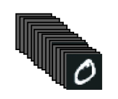

# Lecture3 Engine Neural Network

## 1. How does learning happen?

### Kernel and Bias


$$
\text{output} = \text{relu}(\text{dot}(\text{input}, W) +b)
$$

- We saw that dense layers are these combination of operations, where $W$ and $b$ are **parameters** of the layer
- Those two matrices are called the **kernel** and **bias** attributes of  the dense layer
- Initially, they are **randomized**
    - i.e.  assigned random values


### Training loop

1. Draw a batch of training samples `x`, and  corresponding labels `y_pred`.




```python
batch = train_images[:128]
batch = train_images[128:256]
n = 3
batch = train_images[128*n:128*(n+1)]
```

2. Run the model on `x`  (**forward pass**) to obtain predictions `y_pred`


3. Compute the **loss** of the model on the batch, a measure of the mismatch between `y_pred` and `y_true`
4. Update all weights of the  model in a way that slightly  reduces the loss on this  batch.


## 2. How to Update Weight?

### Weight initialization: Randomly


- A linear layer with
    - 3 inputs
    - 2 outputs
    - its weight (w) is a (2 x 3) matrix (and a bias term (b))

- **This layer wouldn’t do anything useful**.
    - (I.e., a randomly initialized model for MNIST classification would show about 10% accuracy)

### Update the weights - A naive approach (X)


- Change one coefficient at a time,
    - e.g. increase its value by a little.
- Do the forward pass again, see if  the loss improved.

| Weight Adjustment                                 | Loss Computation                                             |
| ------------------------------------------------- | ------------------------------------------------------------ |
| Weight Initialization                             |  |
| Increase the first element in $W$, loss increases |  |
| Decrease the first element in $W$, loss decreases |  |

- This is terribly inefficient
- For a middle size network, e.g.  400k parameters, this is 800k forward passes
- In other words, we’d like a method that can **update all the weights** (slightly increase or decrease the value in a way that the model gets **better** (show a lower loss)

### Gradient Descent

> Invented in 1847 by French mathematician  Louis-Augustin Cauchy
>
> It is an optimization technique that powers modern neural networks


- Core idea: The “**gradient**” encodes information about what **small change to each coefficient** (i.e. positive or negative) will **decrease the loss the most**
- Using that information, you can change the coefficients iteratively until finding **a minimum value** for the loss

#### How

|  |
| ------------------------------------------------------------ |
|  |
|  |
|  |
|  |

#### Naive Gradient Descent


Given a function $l(w)$ that you want to minimize with respect to $w$, do:

1. Initialize $w_{iter}=w_0$ in a random point
2. In a loop, do:
    - $w_{iter} = w_{iter} - lr \cdot rc$
    - where $rc = \frac{l(w_{iter}+\epsilon)-l(w_{iter})}{\epsilon}$
    - $lr$: **learning rate** (or **step size** in optimization)
3. Repeat step 2 until reach N iterations

## 3. Gradient

### What is Gradient?


### 1D → N-dim parameters


- The 2D plots so far
    - parameter space on x-axis (1-dim param)
    - loss function on y-axis
- Actual neural network models have **many parameters** (like, thousands or millions or billions)
    - parameter space is **N-dim** (i.e. w is a N-dim array)
    - loss function `y=f(input, w)`

### GD in Tensors

When working with tensors, GD is applied to each element of the tensor in the same way as before.


To know the value of $l(W_{iter})$ we need to do a forward pass, so actually $l(W_{iter}) = l(W_{iter},X)$ where is the input data.

### Stochastic Gradient Descent

We can’t fit all the data in memory at once to compute the gradient. We use **batches of data** instead

Stochastic Gradient Descent (SGD) is **GD over batches**. 


- where $l(X_{iter},W_{iter})$ is the loss over one batch of data $X_{iter}$

#### Variants and Extensions of SGD

Many variants and extensions of SGD incorporating many tricks

- SGD with momentum
- RMSprop
- Adam, AdamW
- Adagrad

### Learning Rate (aka step size)


- If **too big**, SGD might not converge (find the minimum)
- If **too small**, SGD will take a lot of iterations (and time)  to converge. If number of iterations is not enough, it won’t find the solution.
- Safe bet: **start with a biggish and a few iterations,  observe a batch of validation data and tune it**.


### Momentum

In DNNs there are many “valleys” where SGD can get stuck, and momentum helps it to “keep going”.


### Local Minimum


- SGD is not infallible
- Momentum typically helps in this cases, but  also not infallible
- Good news: local minimums in DNNs are not that bad

### Backpropagation

Backpropagation is a clever trick to compute the gradient of the loss with respect to the parameters through multiple layers (=deep learning models!)


- **Main idea**: all the **gradients** of the tensor operations in the network **are known** in advance by TensorFlow, Keras, PyTorch.  Backpropagation combines the gradients of each layer to form the gradient of the loss.

### Takeaways

- SGD is very sensitive to the learning rate. Momentum often helps
- What is important when choosing an optimizer?
    - Choose an optimizer with momentum and some trick for adjusting the learning rate (e.g. Adam)
    - Choose a **big learning rate to start with** (e.g. 0.01 with Adam). 
        - If network doesn’t converge, make it smaller. 
        - Bigger $lr$ speeds things up. 
        - Always monitor the loss!.
    - Choose **a small number of epochs to start** (e.g. 10) and a small part of the data. 
        - If SGD (or variants)  converges, augment the data and/or epochs until you reach the size of your problem. 
        - If it doesn’t converge, you needs more epochs

## 4. Remember these terms

- Training loop
- Batches
- Optimizer
- Loss function
- Gradient
- Gradient Descent
- Stochastic Gradient  Descent (SGD)
- Learning rate
- Number of iterations
- Momentum
- Back propagation
- Convergence
- Global minimum
- Local minimum

### Training in a nutshell

