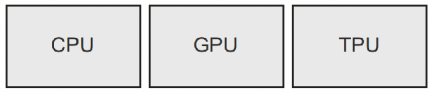
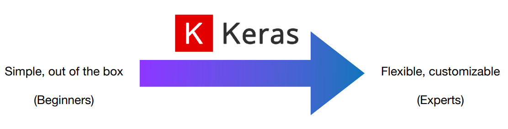
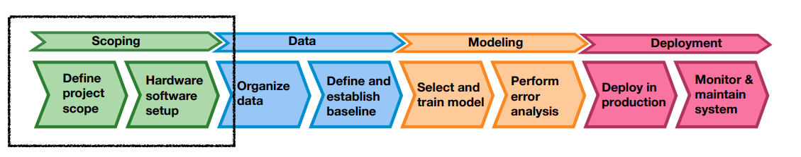
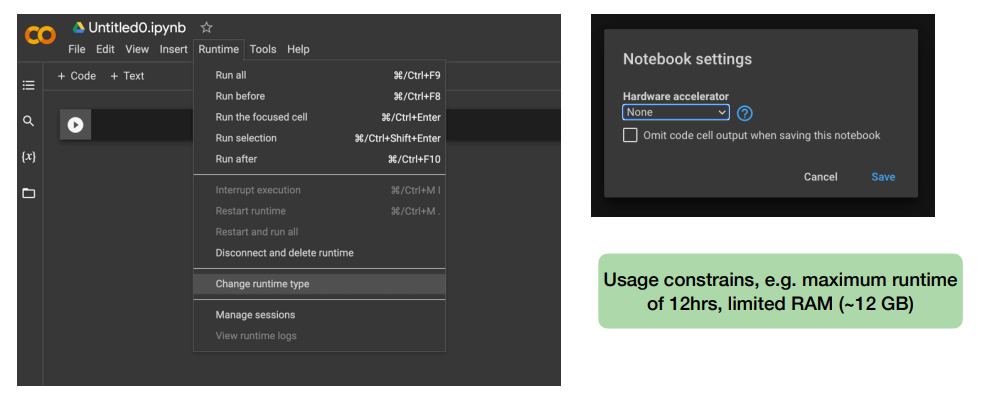

# Lecture4 DL Project

## 1. Deep Learning Frameworks


Common

- They automatically compute gradients of  differentiable expressions
- They can run on CPUs, GPUs, TPUs
- Computations can be easily distributed across  many machines

Difference

- Pytorch is a bit easier to debug and do  customized operation with. (Researcher’s choice)
- TensorFlow programs can be exported to other  runtimes such as C++, Java-Script (for web  apps) or TensorFlow Lite (for mobiles and  embedded devices).

| Deep Learning Layers                                         | Description                                                  |
| ------------------------------------------------------------ | ------------------------------------------------------------ |
|  | Deep learning development: layers, models,  optimizers, losses, metrics |
|  | Tensor manipulation infrastructure: tensors,  variables, automatic differentiation, distribution |
|  | Hardware: execution.                                         |



## 2. Setting up a Deep Learning Project



### Scoping

#### Define project scope

- What is the project about?
    - E.g.: classification of fashion items
- Do you have data for this problem?
    - E.g. Yes! The Fashion-MNIST dataset
- Decide on metrics. 
    - E.g.: accuracy
- Estimate resources and timeline. 
    - E.g.: Your laptops, and from today’s class until EOW

#### Hardware Execution




#### Local vs. Remote & Conda

- Different projects have different software needs in terms of 
    - e.g. Python version and packages versions
- It’s important to have those well defined for reproducibility

**Conda**

- a package and environment management system to create and switch environments  in your local computer
- For Windows user: is recommended to use TensorFlow with a Unix workstation
- Keras and TensorFlow will automatically  execute on GPU if available


- Install Miniconda: `https://docs.conda.io/en/latest/miniconda.html`
- Create an environment: `conda create -n [env_name] python=[version]`
- Activate environment:`conda activate [env_name]`
- Install packages: `pip install [package_name]`

#### Python and Python Environments


Why many environments?

- one environment per project
- Different versions of Python and installed packages act differently, whereas we want a consistent behavior within a project
    - I.e., reproducibility

How should we do?

- Perhaps it’s okay during this semester to use one env for all the homework etc.
- Colab has some default setup and pre-installed packages for convenience.

#### Python Packages


- There are several packages we will use:
    - **Numpy** (standard numerical computation tool in python)
    - **TensorFlow**, **Keras** (specialized in deep learning)
    - **Matplotlib** (image plotting)
    - **Jupyter** (easier visualization and prototyping)
- Some audio/image specific packages
    - mirdata
    - soundata
    - librosa
    - kapre (with TF), torchaudio (with Pytorch)

### Data

#### Organize Data


Dataset statistics: 

- How is the distribution of classes?
- How are the items labeled?

#### Define and Establish a Baseline

Provides a benchmark to:

- Measure progress
    - as a starting point to measure progress.
- Avoid pitfalls
    - are complex models needed or simple is enough? Overfitting?
- Set expectations
    - what is achievable with the data and resources available?
- Provide a reference for future work

You can have multiple baselines, some common ones are: 

- rule-based models
- previous research
- a minimal model (e.g. linear regression)
- human-level performance

### Modeling

#### Model Definition

Different types of layers are appropriate for different tensor formats and different data processing. 

- **Simple vector data** (samples, features): are usually processed by **densely connected layers**  (also known and **fully connected** or **dense layers**)
- **Sequence data** (samples, time steps, features) are usually processed by **recurrent layers**, such as **LSTMs** or **GRUs**
- **Image data** (samples, hight, width, channels) are usually processed by **convolutional layers**


 Layers are connected like LEGO bricks

- Layers will only “clip” together  when they are “**compatible**”
- Keras dynamically builds layers to be compatible with the output of the previous layer

#### Compilation Step

In the compilation step you define the **optimizer** and **loss function** for your model.

- **Optimizer**: ideally a version of **SGD with momentum** and **adaptive learning rate** (e.g. Adam)
- **Loss function**: choose a loss that is appropriate for your problem.

Some Examples

- **Regression problems**: mean squared error (MSE), mean absolute error (MAE), Huber loss.
- **Binary or multi-label classification problems**: binary cross-entropy.
- **Multi-class classification problems**: categorical cross-entropy, sparse categorical cross-entropy.
- **Imbalanced classification problems**: weighted cross-entropy, focal loss.

#### Monitoring the loss

The goal of learning is that **models perform well in general and not only in the training data**

**Validation set**: a subset of the training data to “keep an eye” on how the model performs on unseen data. Is given to the model in the fit( ) method


#### Model Evaluation

Once trained, you want to make predictions on new data (the **test set**). This is called **inference**.

You can obtain predictions by simply doing:


```python
# Make predictions using the model
y_pred = model.predict(x_text)

# Convert the predicted probabiliies to the class labels
y_pred = np.argmax(y_pred, axis=1)
```

To evaluate accuracy


```python
# Calculate the accuracy by comparing the predicted labels with the ground truth labels
test_acc = np.mean(y_pred == y_test)
```

## 3. Remember these terms

- TensorFlow
- Keras
- PyTorch
- CPU
- GPU
- TPU
- Workspace
- Environment
- Preprocessing
- Baseline
- Normalization
- Reshape
- Validation loss
- Monitor loss
- Accuracy
- Inference