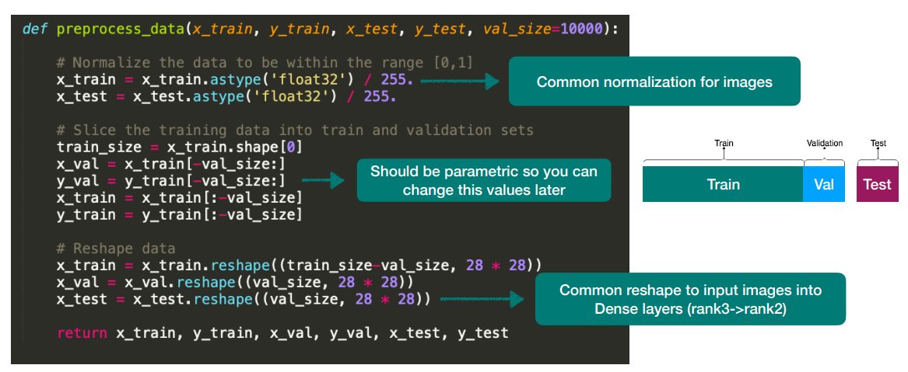

# Lecture5 Classification

## 1. Exercise Broken Down

### Task

> Fashion-MNIST classification with dense neural network
>
> In this exercise, you will build a deep neural network to classify images from the Fashion-MNIST dataset using only dense layers. The Fashion-MNIST dataset is a collection of images of clothing items, where each image is a 28x28 grayscale image of one of 10 classes.
>
> 

Single-label, multi-class classification problem.

### Load Data

### Pre-process Data

A lot of time typically goes into organizing data

### Build Model

#### Activation function

Dense layer without activation

$$
\text{output}=\text{dot}(\text{input}, W)+b
$$

- If you stack many of this, the resulting  transformation is still linear. Your model  is very restricted on what it can learn.

Activation functions allow the network to learn **non-linear transformations**

##### Activation Function in the Intermediate Layer

##### Activation Function in the Last Layer

Binary-class Classification Problem: **Sigmoid**

Multi-class Classification Problem: **Softmax**

#### Loss function

A measure of **how good** your model predictions are. Signal used in training.

The choice of the loss function depends on the problem.

- For our: Single-label, multi-class classification problem
    - Categorical cross-entropy
    - Sparse categorical cross-entropy

##### Cross-entropy loss

A quantity that measures distances between probability distributions, or ground truth distributions and predictions.

- The cross-entropy loss and sparse categorial cross-entropy loss are mathematically  equivalent, is just a  different interface

For binary classification
$$
L = -\frac{1}{N} \sum_{i=1}^{N} [y_i \log(p_i) + (1 - y_i) \log(1 - p_i)]
$$

- $L$ is the loss for the entire dataset
- $N$ is the number of samples
- $y_i$ is the actual label (0 or 1)
- $p_i$ is the predicted probability of the class being 1 for the $i_{th}$​ sample

For multi-class classification
$$
L = -\frac{1}{N} \sum_{i=1}^{N} \sum_{c=1}^{M} y_{ic} \log(p_{ic})
$$

- $L$ is the loss for the entire dataset
- $N$ is the number of samples
- $M$​ is the number of classes
- $y_{ic}$: a binary indicator (0 or 1) if class label $c$ is the correct classification for observation $i$
- $p_{ic}$: is the predicted probability that observation $i$ is of class $c$

#### Metrics

We use them to know how training is progressing. 

This signal is NOT used by the model during training.

##### Accuracy

$$
acc = \frac{\text{correct predictions}}{\text{total number of predictions}}\\ acc = \frac{4}{6} = 0.67
$$

### Train Model

- The `fit()` function has other input parameters you can use to tune the training of your model. 
- Take a look at the documentation!

### Test Model

### Classification Problem

#### Single-label, Binary (=2-class)

- Binary classification is a special case of classification where `num_class == 2`. 
- Treat it as such — use sparse categorical cross entropy, softmax, etc.

#### Single-label, Multi-class

## 2. The fitting problem

### Overfitting

- The model focuses on what it has seen (training examples)
- Too much that it only memorizes the seen examples by focusing on irrelevant details
- Fail at unseen examples

#### How can you mitigate overfitting?

Early stopping

- Looking at the train and validation losses, you can estimate the number of  epochs needed for a robust fit (or use  the early stopping callback in `fit()`)

All the things you can find in other resources (web, books, ..)  — such as 

- regularizers
- adding noises
- dropout
- batch norm
- getting more data

 are about preventing the model to  memorize training examples by their irrelevant aspects

### Underfitting

It could also happen that your model doesn’t overfit ever. Then it’s too small!

#### How can you mitigate underfitting?

- We need a larger model capacity. 
- Increase the model size or stack more layers until the model is able to overfit.

## 3. The generalization problem

### Distribution of training samples

> Given a picture - dog or cat?
>
> 

### The bias problem

- Our models are not impartial. 
- There are always biases we have to take care of.

#### How can you mitigate biases?

Data: Collect more data to balance the dataset.

Data: Balance the distribution with synthetic data.

Sampling: Oversample the less represented class.

Sampling: Undersample the majority class.

Loss: Weight the loss to compensate for imbalance.

