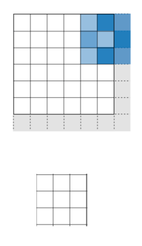

# Lecture6 Computer Vision CNNs

## 1. Introduction to CNN

### Biological inspiration

The relationship between components of the visual system and the base operations of a convolutional neural network. Hubel and Wiesel discovered that simple cells (left, blue) have preferred locations in the image (dashed ovals) wherein they respond most strongly to bars of particular orientation. Complex cells (green) receive input from many simple cells and thus have more spatially invariant responses. These operations are replicated in a convolutional neural network (right). The first convolutional layer (blue) is produced by applying a convolution operation to the image. Specifically, the application of a small filter (gray box) to every location in the image creates a feature map.

### Translation invariance

- Models are not “intelligent” beyond  what they’re made for
- Dense layers don’t model spatial relationships between pixels in an image: a change of position is like  “new data”

### The convolution operation

Images can be broken down into local patterns such as edges,  textures, etc.

- Convolutional networks are built to account for  those patterns

## 2. Convolutional Neural Networks

- Convolutional neural networks (CNNs), are a specific type of neural networks that are generally composed of convolutional, pooling and dense layers.

### The Convolution Operation

|  |  |
| ------------------------------------------------------------ | ------------------------------------------------------------ |
|  |  |

|  |  |  |  |
| ------------------------------------------------------------ | ------------------------------------------------------------ | ------------------------------------------------------------ | ------------------------------------------------------------ |
|  |  |  |  |
|  |  |  |  |
|  |  |  |  |

### What is convolutional layer about?

- One Convolutional layer == one **convolutional operation** (but **multichannel** usually; to be covered later)
- Convolutional operation is a 2-D shaped inner product.
    - It is about finding a **similar pattern**; as the output would be larger if two input vectors of inner product are similar.
- While finding a **similar pattern**, it also optimizes which pattern to find by **updating the weights** (=kernel, or filter) of the conv layer;

### Stride and Padding

#### Stride

A common stride is 2

|  |  |
| ------------------------------------------------------------ | ------------------------------------------------------------ |
|  |  |

#### Padding

Using stride=2

| Valid                                                        | Same                                                         |
| ------------------------------------------------------------ | ------------------------------------------------------------ |
|  |  |
|  |  |
|  |  |
|  |  |

- Padding has an effect of how  we handle the borders

#### Choosing padding and stride

### Kernels and Channels

How does it work when it’s multichannel? e.g. input has 3 channels, output has 1 channel

#### Different kernels will learn different patterns

- This are the 16 filters of a convolutional layer.
- The kernel size is 5.

- You can look at the feature maps as they were images.
- This are the 16 feature maps corresponding to the convolution with  each filter.

#### Choosing filter size

- Actually a pretty fuzzy choice.
- There have been some papers focusing on filter sizes, but it’s **hard** to get a general lesson.
- For this class, let’s stick with (3, 3). (ref: this is the “vgg” way, and very common)

#### Choosing number of filters

- This is equal to the **max number of patterns we like a layer to learn**.
- Similar to the number of units in dense layer; or how “wide” layers should be.
- Again, no single rule exists.

### Max Pooling

- Similar to a convolution but without  learning the filter, we take the **max**.
- We only care about the max value;  we don’t care where it came from  exactly.
- This is why a ConvNet is “**invariant**”  to **small local changes**.

|  |  |  |
| ------------------------------------------------------------ | ------------------------------------------------------------ | ------------------------------------------------------------ |
|  |  |  |

- Needed to increase the Receptive Field of the network and decrease its size

### Last: Dense Layer

- Idea: learn hierarchies of patterns (from edges to concepts) in an effective manner.

### Key characteristics of CNNs

#### They can learn spatial hierarchies of patterns

- CNNs’ layers “break down” the image in its main parts,  and learn to combine them in relevant ways in deeper layers

#### The patterns they learn are translation invariant (to some extent)

- CNNs will be able to  understand similar patterns  across the image.

### Application of CNN

#### LeNet (1989)

#### AlexNet (2012)

- One of the earliest successful CNNs

#### VGGNet (2014)

#### ResNet (2016)

- Because it’s difficult to train networks that are too deep.. We added skip connections.

## 3. Wrap Up

### Convolution

- Translation invariant
- Learn hierarchies of patterns
- Main parameters
    - Number of filters
    - Kernel (or filer) size
    - Stride
    - Padding

### Max Pooling

- Needed to reduce network size and overfitting
- Needed to increase receptive field

### Remember this terms

- Convolutional Neural Network
- Filter
- Kernel
- Max-pooling
- Stride
- Padding
- Convolution
- Translation invariance
