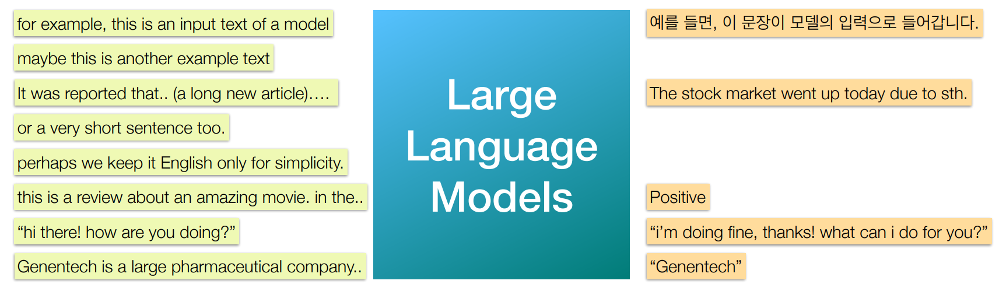
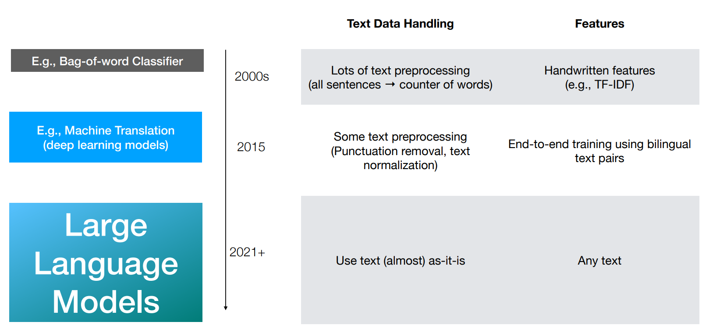

# Lecture7 Transformer and Language Model

> Intro to Large Language Models by Andrej Karpathy https://www.youtube.com/watch?si=SSCVcFyY9FduwHbW&v=zjkBMFhNj_g&feature=youtu.be

## 1. Introduction

### Traditional Language models

LMs take text as input and does something useful such as

- classification
- named entity recognition
- translation
- completion
- summarization
- Q&A
- chat

### Large Language Models

Large language models (e.g., GPT, llama, Gemini) are so powerful that then can various  natural language tasks very well

### Old <-> New Language Models

- bag-of-word: collect a bunch of positive or negative words

Traditional Models are Small Models

- With relatively limited resources (HW and data), we could handle **smaller** models only
- Each model was trained for a **specific task** e.g. summarization, sentient analysis, etc

## 2. Language As Data

- **image**: (row, col, channel), pixel with colors
- **text**: a sequence of characters

### Neural Networks for Sequences

| Illustration                                                 | Description                                                  |
| ------------------------------------------------------------ | ------------------------------------------------------------ |
|  |                                                              |
|  | Split the sentence into sequence of words                    |
|  | Sequences with Single output If sentient analysis: positive or negative? [0 or 1] |
|  | Sequences with Sequence output If embedding learning: Each “Out n” is a vector that represents n-th word Limit of this approach What if we want a chat bot? or translation?  I.e., The output is not 1:1 to input words but  about the whole input sequence. |
|  | Sequence-to-sequence Eg. Conversation                   |
|  | Sequence-to-sequence Eg. Machine Translation            |

### Word to vector (embedding)

#### Embedding layers

Embedding layer is a (trainable) Dense layer that maps each word to a vector

- vocabulary size = 8 in this cases
- each vector using a one-hot? representation

#### Advanced: It’s not always “word”-based

There are **too many words** (like, millions of them) to handle. Words are not always completely independent to each other. e.g., “Speak” “Speaker”  “Speaking”, “Speakers”, ..

1. **Words**: used to be a choice: `speakers`
    - **Length**: A document can have few thousands words
    - **Vocab size**: even 50k is not enough; so out-of-vocab becomes an issue
2. **Characters**: `s`, `p`, `e`, `a`, `k`, `e`, `r`, `s`
    - **Length**: A document can have a hundred of thousands words (kinda too long)
    - **Vocab size**: English only has 26 alphabets: so it’s good, but kinda too small
3. **Sub-word tokens**: `speak`-`er`-`s` (split the word into smaller units that somehow meaningful)
    - Can be optimal in both length and vocab size

## 3. Sequence-specialized Models

What do we want from such a model?

- Can handle a long sequence
- Can **remember** the sequence of input vectors, **process** them, and perform tasks **based on** the inputs.

### RNNs: Recurrent Neural Networks

#### Inside a recurrent unit

- Operations that are expected to mimic
    - save (input)
    - load (output)
    - delete (forget)
- .. as long as they were trained to do so, implicitly, because perhaps they would be helpful to do the task,
- i.e., lower the loss and perform the training task

#### Output of RNN

#### Pros and Cons of RNNs

- **Pros**
    - It can handle sequences with arbitrary length.. in theory
    - With some modifications (e.g., LSTMs), it simply performs really well
    - Memory-efficient as the input sequence gets longer
- **Cons**
    - Long sequence == A very **deep** network → Difficult to train
    - N-length sequence → N-times matrix multiplication → Large latency
    - The final internal state is supposed to remember everything in the past → Is it even possible

### Transformers

| First Paper about Transformers                               | GPT-3                                                        |
| ------------------------------------------------------------ | ------------------------------------------------------------ |
|  |  |

#### Everything connects to everything

| Illustration                                                 | Description                                                  |
| ------------------------------------------------------------ | ------------------------------------------------------------ |
|  | Input word vector, forming a 2d dimensional channel input    |
|  | Mutual “Relatedness” is  computed by computing &  comparing all the 4 x 4 = 16pairs,  when input length is 4. |

#### Pros and Cons for Transformers

- **Pros**
    - It outperforms RNNs and easy to train
    - It take all the mutual relationship between words
- **Cons**
    - $n$ words → $n^2$ relationships to compute and store → expensive!
    - It doesn’t work with arbitrary length

#### To Learn More

Search for these

- Illustrated Transformers
- Annotated Transformers

## 4. Large Language Model

### LLM = A lot of transformer layers

### Coming back to Tasks

- Not ideal that we have to train $N$ models for $N$ tasks.

### Autoregressive training for Pre-training

> Autoregressive models are a type of statistical model used in time series forecasting and **sequence prediction**. 
>
> The core idea is that the **future state of a sequence depends solely on its previous states**. This is particularly powerful in fields like language modeling, where the sequence of words is predicted based on the preceding context.

As known as “next-token prediction”

- At one step, the model  performs and learns from 6 token predictions. → Efficient!
- OpenAI and others trained LLMs with this objective;  using A LOT of data. We call it **LLM pre-training**.
- After pre-training, the model  becomes excellent at text  completion; called  “**foundational model**”

#### Next token prediction as pretraining task

- Used in all the modern LLMs (GPT, GPT2, GPT3, LLaMA, etc)
- Universally useful for some specific task.
- Effectiveness, relevance: That’s how we speak and how we think to speak
- Efficiency: If 2048 token length, we make 2048 predictions, get 2048 losses  (information about how the model is doing), make update related to 2048 of them!

#### Autoregressive training for finetuning

- Once the model is good at  text completion, we can  further train the model to **steer the direction of the answer**.
- A specific application is “instruction finetuning” i.e.,  **tune** the model to perform a given task.
- This makes GPT → ChatGPT.

### Summary

- Language Models have advanced a lot, and these days they’re really strong. 
- The modern language models consists of deep learning models that can handle sequential data. 
- Data processing is still a part of the work, although it’s becoming less and less important. 
- Language Models are not perfect!

#### What do they learn?

- Originally: to predict the next tokens
- Now: Perfect grammar and writing + Questionable logical thinking

#### Why is it so amazing?

- Text data
    -  A LOT on internet
    - Very cheap to get and handle (unlike images, audio, music)
    - Language is a crucial and complex representation of our knowledge; arguably  the most important invention of human species