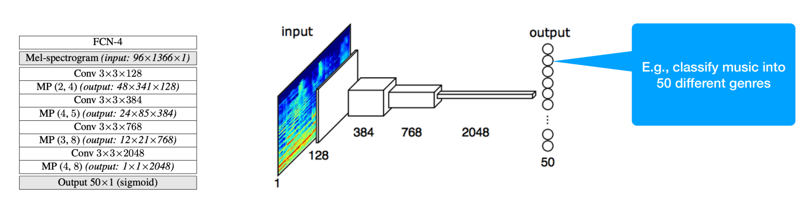
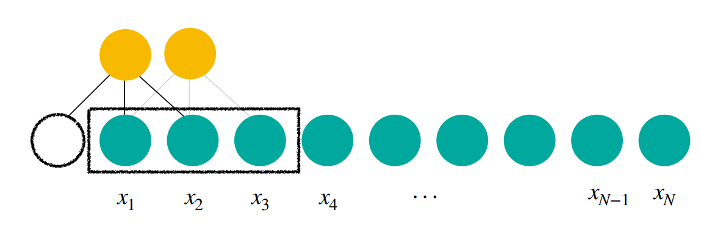
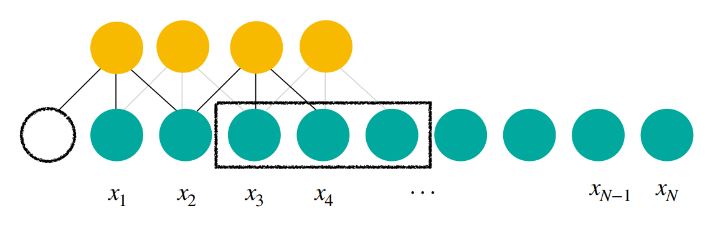
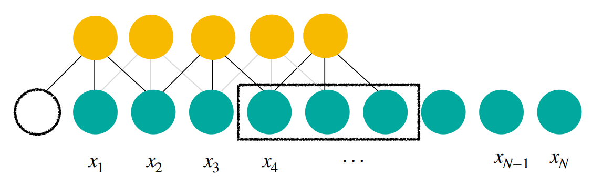
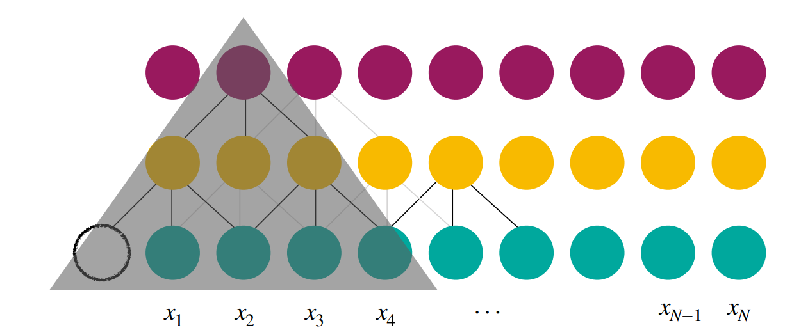
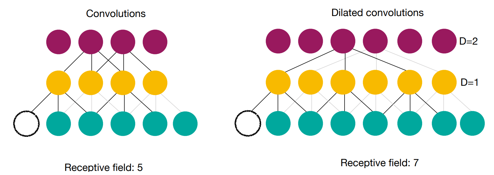
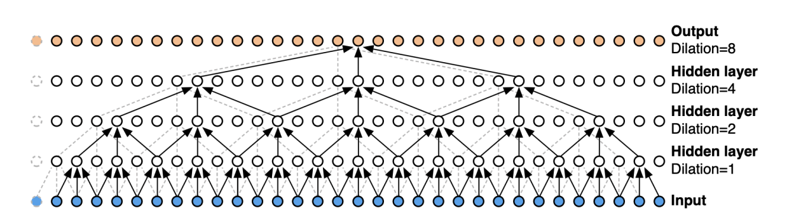

# Lecture9 Audio and Temporal Convolutional Networks

## 1. Limitation of CNN and Temporal Consideration

### Limitation of 2D CNNs for Audio/Music

2D CNNs, as if spectrograms are images

- Of course spectrograms are not exactly visual images. But.. turns out they aren’t too different. In this way
    - The model learns both time and frequency-axes pattern
    - Suitable if we make a decision for the **whole input audio**, i.e. audio clip level classification

### Sequences

- Unlike images, Audio waveforms are **sequences**: each sample is a number in that sequence and it is related with its neighbors
- This temporal relationship allows us to perceive concepts such as melody or  rhythm in music

|  |  |
| ------------------------------------------------------------ | ------------------------------------------------------------ |

- A spectrogram can be seen as a sequence of vectors

### Temporal Relationship

- Do CNNs account for this temporal relationship?
    - Answer: Yes.. kind of. But the 2D CNN we learned is designed for 2D patterns.
    - Why don’t we make it even more explicit to learn 1D, sequential patterns?

#### Waveforms are too long

- A convolutional network model focused on learning temporal patterns
    - because we want to find some temporal patterns
    - How? → By applying 1D convolutional layers to time-series
- Yes, typically we’re talking about time-series, such as waveforms
- Typically those time-series are **very long** (like, 100k or 1M+ samples) — much longer than image pixels

#### Receptive field in a convolution

|  |
| ------------------------------------------------------------ |
|  |
|  |
|  |
|  |
|  |

- Red Neuron: Supposedly a “high-level” feature, which should be about somewhat long pattern
    - (e.g., 1 or 30 seconds, not 5 samples (=0.0001s)).
    - In another words, receptive field is too small/short

#### Dilated convolutions

- The receptive field gets dramatically increased with dilations the using increasing  dilations as we go deeper in the network
    - E.g. with 4 dilated convolutional layers you get a receptive field of 33 input samples, with a  spectrogram sampled at 100Hz that is 0.33s vs. 0.1s in a “common” CNN (10 samples). With  11 layers this difference becomes bigger: dilated CNN (4097, 41s), CNN (23, 0.23s)

## 2. TCN: Temporal convolutional networks

### Components

TCNs are composed of two main components

- Increase the **receptive field** of the network
- Allows the network to learn patterns at multiple scales
- Effective: high parallelization and lower network capacity

TCN is build from residual blocks with different dilation rates

### Advantages

#### Traditional RNN

- TCNs are not the only DNNs that can take into account temporal context.
- RNNs have been great for a reasonably long sequences such as short texts (a sentence or a  paragraph), i.e., <100 steps.
- But we’re talking about 10k or 100k or 1M steps!

#### TCN

- Simple structure!
- Unlike RNNs, they can be trained in parallel → much faster training + optimal GPU usage
- Unlike RNNs, **no gradient vanishing** → work on long sequences
- Variable length inputs (rolling 1D convolution)

### Causality (因果性)

You can make TCNs causal and thus suitable for online (real time) applications

- only consider the sequence before the current input (drop the red line)
- Prediction at $t$ only relies on the things before $t$ 

### FYI, WaveNet

Causal + Dilated 1D CNNs + Residual connection for generation = WaveNet

### Summary

- A simple 2D CNN can be a better choice if the task is a clip-level decision. Spectrograms are good representations! Don’t worry about using it.
- TCNs can be a great choice if it’s a frame-level, time-varying decision.

### Resources

- [Lecture 5.4 - CNNs for Sequential Data (youtube.com)](https://www.youtube.com/watch?v=rT77lBfAZm4)
- [An Empirical Evaluation of Generic Convolutional and Recurrent Networks for Sequence Modeling (arxiv.org)](https://arxiv.org/pdf/1803.01271.pdf)
- [GitHub - philipperemy/keras-tcn: Keras Temporal Convolutional Network.](https://github.com/philipperemy/keras-tcn)
- [Tempo, Beat, and Downbeat Estimation — Tempo, Beat and Downbeat Estimation (tempobeatdownbeat.github.io)](https://tempobeatdownbeat.github.io/tutorial/intro.html)

#### Remember this terms!

- Dilations
- Temporal convolutional networks
- Receptive field
- Temporal context
- Sequential data

